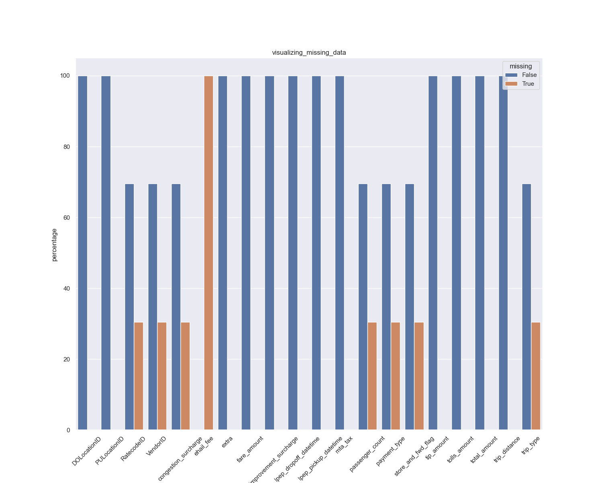

# Data Visualize and Analysis
## 1: Observed the dataset's basic information and found the columns having missing values.

- ehail_fee: the missing indexes equal to the datapoint of the dataset => remove ehail_fee
- Other columns that have missing values include: VendorID, store_and_fwd_flag, RatecodeID, passenger_count, payment_type, trip_type,congestion_surcharge and they have the same percentage of missing values

## 2: Preprocess
### Outliers:

- fare_amount, total_amount, and extra columns have negative values that do not gain insight in EDA => remove the negative values.
- Trip_distance has the 0 value but scatters all along total_amount => keep it for analysis.
 

- improvement_surcharge,mta_tax, congestion columns have negative values that do not gain insight in EDA => remove the negative values.
- RatecodeId,passenger_count, and mta_tax columns have some outliers, which are 99,0 and 3.55 => do more research => suggesting removing or replacing them with the most count values.

### NaN/missing values:

- VendorID = 2, store_and_fwd_flag = N, passenger_count = 1 and trip_type = 1  have the most count => replace missing values with the most count values.
- payment_type have values: 1 (credit card) and 2 (cash) with almost the same percentage => replace missing values with randomly between 1 and 2.

### Decode categorical variables
### merging two datasets: the current one with [taxi zone look up](https://www.nyc.gov/site/tlc/about/tlc-trip-record-data.page)

### extract time _diff = (lpep_dropoff_datetime - lpep_pickup_datetime).seconds/60, pickup/dropoff month, weekday, hour and bin_hours into [3 bins](https://nyc.gov/site/tlc/passengers/taxi-fare.page): [16,20) - rush, [20,6) - overnight, [6,16) - other 

 ## 3: EDA Univariate:
### EDA continuous variables:
  
### EDA caterigocal variables:
 
#### EDA dual caterigocal variables:

- As observed in the plot above, the dataset is highly unbalanced.
- Generally, there is no difference between pickup and drop off.

## 4: EDA Bivariate:
- The range values of tip_amount for EDA: [0,64.12]
- The range values of total_amount for EDA: [0, 80,38]

### EDA continuous variables with tip_amount:

- There are not many columns that have a linear relationship to tip_amount
### EDA categorical variables with tip_amount:

#### EDA dual categorical variables with tip amount:

 - There are many overlaps on these boxplots, especially on time variables and outliers appear thickly and scatter through tip_amount.
### EDA categorical variables with total_amount:

- While other columns overlap, the boxplot RatecodeID shows that distribution values of 1 and 5 are lower than the others and some outliers. The lowest number of samples belongs to 6. On the other hand, 3 and 4 have the largest range of the number of samples and the total amount.
#### EDA dual categorical variables with total_amount:

- In some boxplots between location variables and total_amount, we can see a slight difference between drop-off and pick-up on the distribution values. But on the time variables, there is no difference between pick-up and drop-off.
  
### comparison between Time variables and tip_amount, total_amount:

- lineplot: estimator=mean, errorbar=None, marker="o"
- The drop-off and pick-up lines do not show much difference between them except for the line plot of the hour.
- 
#### pickup/dropoff hour
 
- The lowest peak is 3 a.m. and then increases gradually to the highest peak at 8(pickup)/9(drop-off) am. After that hour, the average tip slowly reduces to the peak at 15 p.m.; from there, the mean tip rises to the peak at 17(pickup)/19(drop-off) and 19 (drop-off) p.m and goes down. => The top tip is that often the hour of people go to work and leave the workplace.
- Compared to the total amount, the highest and lowest peaks are different. The lowest peak is 0 a.m., and then the average of the total amount increases to the highest peak at 4(pickup)/5 drop-off am. From there, the average total amount decreases until 8 a.m. They remain stable from peak 8 a.m. to 16 p.m. and reduce the average total amount from 16 p.m. to 19 p.m. From 19 p.m. on, the value stays stable.
#### pickup/dropoff month:

- In general, the line in both line plots shows an increase over the months. 
- In January, the average tip and total are the lowest.
- From January to May, the line of average tip is fluctuating. But from May on, the line steadily increases and rises to its highest peak in December. => The closer to the end of the year, the more earned tip.
- On the total amount line plot, the line at peak January start go down to the lowest peak March. From March, the line reaches the highest peak in August and then decreases. => From Fall to Winter is the period of gain the most money.
  
#### pickup/dropoff weekday:

- In general, the line in both line plots show an decrease over the weekday.
- The highest tip is on the Monday, and the highest tip is on the Sunday. => The closer to the end of the week, the less earned tip.
- On the other hand, the highest total amount is on Tuesday, and the lowest total amount is on Saturday. And the line rises from saturday to sunday. =>  The total amount on weekend is less from weekday.

#### pickup/dropoff bin hour:

- As observed, the both barplots from the tip amount and total amount are showing that the number of taxi trips which mainly focus on the bin hour: [6,16) - other  => [16,20) => rush, [20,6) - overnight.
### Location variables:
#### pickup/dropoff borough:

- In barplot of tip amount, the distribution of pick-up and drop-off is show no difference. The highest bar belongs to Manhattan and the lowest belongs to Staten Island.
- In barplot of total amount, the distribution of pick-up and drop-off is slightly different. While lowest bar still belongs to Staten Island in both barplot. On the hand, the highest bar in pick-up barplot is Brooklyn and in drop-off barplot, the highest bar is alike tip mount, which is Manhattan.

#### pickup/dropoff service zone:
  
  

  - In the bar plot of pick-up service zone and tip amount, the highest bar is clearly visible at BoroZone. But the lowest bar is ambiguous between Airports and EWR. On the hand, the barplot of drop-off is more clear, yet the highest bar is still BozoZone, and the lowest bar is known as EWR. When compare side to side, we can see that the range values of tip amount only focus on one bar in pickup's barplot. Drop-off barplot may have a less range of values but other bar is clearly visible.
  - The barplot of total amount has same conclusion as the barplot tip amount.
 #### Top 3 pick-up/drop-off zone:
 
 

- In the pick up barplot of tip amount, we can see the highest bar is East Harlem North, and the lowest bar is Washington Heights South visually. On the contrast, the height of 3 bar in drop-off barplot seems to lower when compares to pick-up barplot. And it is equal to each other, which is harder to identify the differences. And the highest bar is alike to pick-up barplot, but the lowest is unlike, which is Upper East Side North.
- The pick-up zone of total barplot have 2 of 3 bar identical to tip amount, include the highest bar - East Harlem North. The difference here is the lowest bar, Central Harlem. The drop-off zone barplot also has smaller height than the pick-up zone and the height is almost equal. While the highest bar still remain: East Harlem North, the lowest one is East Harlem South.
### PowerBI:

